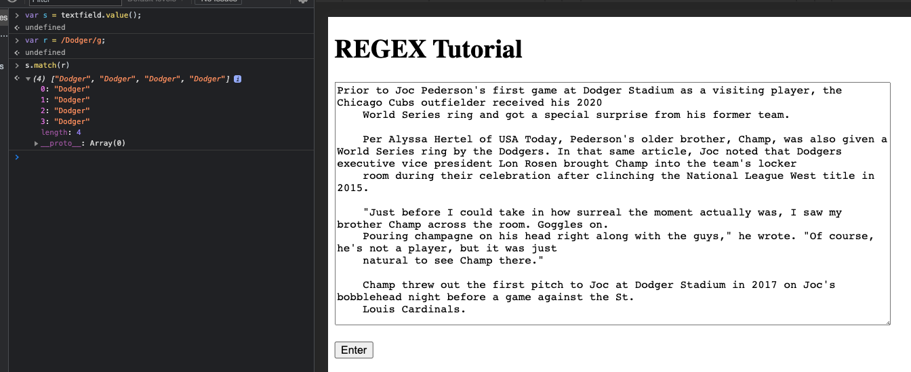
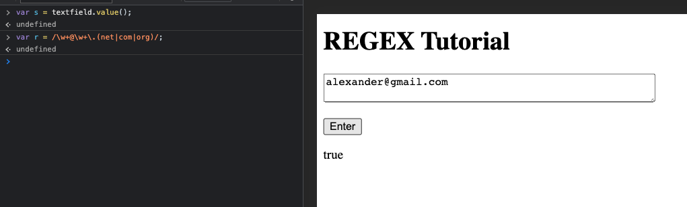
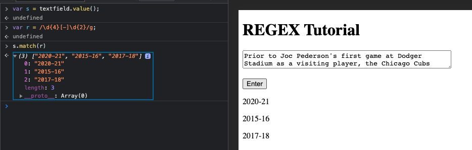
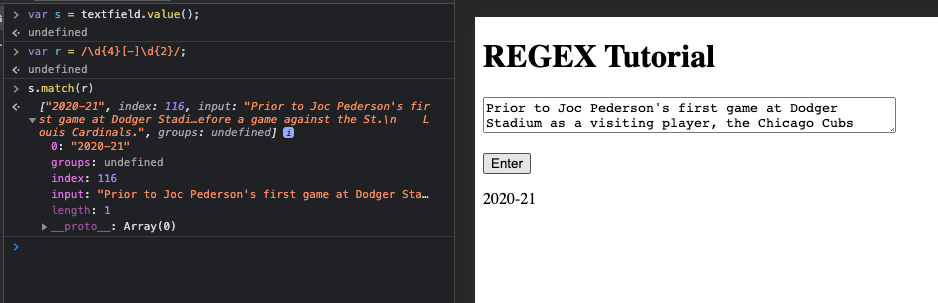
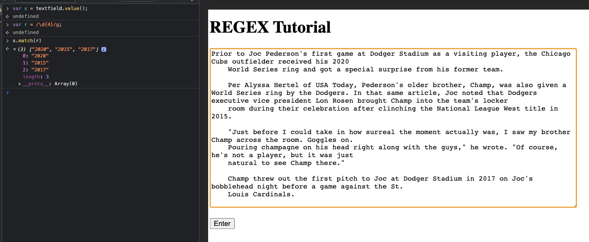
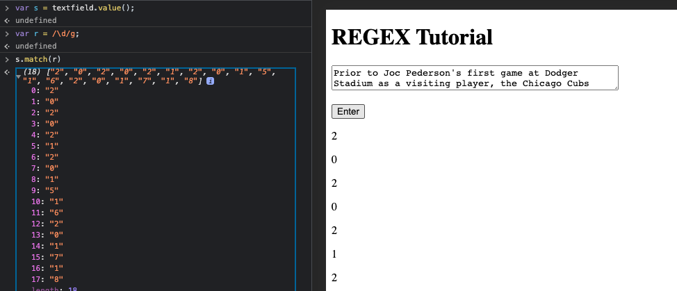
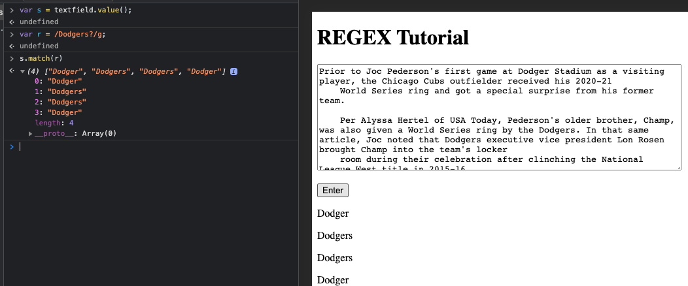
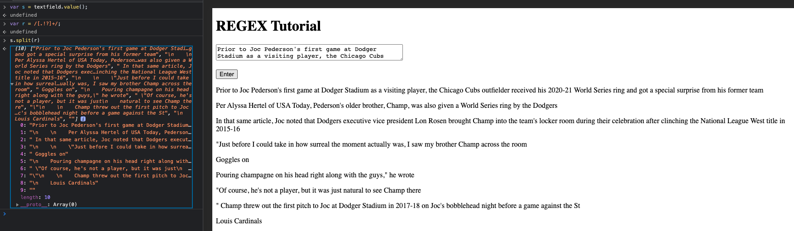

# REGEX

This a gist of regular expressions

## Summary

 What is a regex and how they are utilized. If you look at the sketch.js in file you will be able reference and use the code for your own examples. 

## Table of Contents

- [Anchors](#anchors)
- [Quantifiers](#quantifiers)
- [Flags with Grouping and Non-Grouping](#flags-with-grouping-and-non-grouping)
- [Bracket Expressions in Character Classes](#bracket-expressions-in-character-classes)
- [The OR Operator](#the-or-operator)
- [Character Escapes](#character-escapes)

## Regex Components
  Regular expressions also known as Regex is a sequence of characters that define a search pattern for a text. In other words it allows you to customize search parameters. For example, if you have 
### Anchors

- Regex: var r = /Dodger/g;
Our custom search allows the user to look throughout a text and match our regex statement. Notice the console in the developer tools and you can see there was 4 matches. But pay attention to [The OR Operator](#the-or-operator)

### Quantifiers

- Regex: /\w+@\w+\.(net|com|org)/

| Syntax | Description |
| --- | ----------- |
| \w | contains (A-Z a-z 0-9 _) |
| +@ | followed by @ |
|\w+| followed by any (A-Z a-z 0-9 _)|
|\ .| follwed by any (net  com  org)|
NOTE|NO spacing in console after net com and org |

### Flags with Grouping and Non-Grouping

- Regex: /\d{4}[-]\d{2}/; and /\d{4}[-]\d{2}/g;

| Syntax      | Description |
| ----------- | ----------- |
| \d{4}      | 4 digits        |
| [ - ]   | followed by a dash         |
| \d{2}| followed by 2 digits|
Notice: at the end of the first expression there is a g included. This is called the global flag. The global flag renders all matches, but the example without the global flag only shows the first match.

### Bracket Expressions in Character Classes

- Regex: /\d/g; and /\d{4}/g;

| Syntax      | Description |
| ----------- | ----------- |
| \d      | any digit [0 - 9]        |
| \d{4}  | any digit [0 - 9] { 4 } digits long         |

### The OR Operator

- Regex: /Dodgers?/g;

| Syntax      | Description |
| ----------- | ----------- |
| /Dodger      |Find text that matches Dodger    |
| /Dodgers?  | Find text that matches Dodger OR Dodgers |
### Character Escapes 

- Regex: /[.,?!]/;

| Syntax      | Description |
| ----------- | ----------- |
| [, . ? ! ]     |splits text by puncuation marks  |
|s.split(r)| refer to line #75 of sketch.js |

## Author

Alexander Noreiga 
References: The Coding Train (https://youtu.be/7DG3kCDx53c)

Email: alexnoriega47@gmail.com 
gitHub: https://github.com/norrii1/Portfolio
